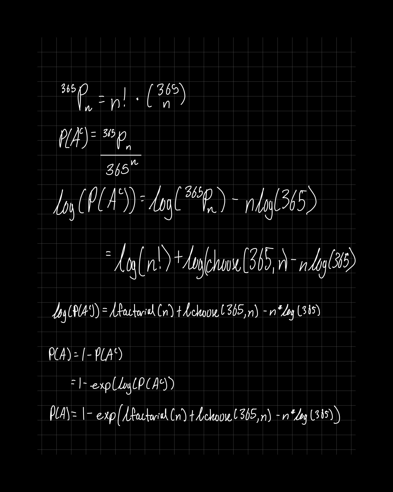

```{r, include = FALSE}
knitr::opts_chunk$set(
  collapse = TRUE,
  comment = "#>"
)
```

```{r setup}
library(MATH4753F25carlpeterson)
```


# Derivation

$$
A:\;\{\text{Two or more people have the same birthday}\}
$$

$$
A^c:\;\{\text{Each student has a different birthday}\}
$$
We know that the sum of all probabilities is equal to 1
$$
P(A) + P(A^c) = 1
$$
$P(A^c)$ represents the probability that each successive student is assigned a birthday different from all the previous ones, leaving one fewer choice each time. This is a mathematical representation of that: 
$$
P(A^c) = \frac{365 \cdot 364 \cdot 363 ... (365-n+1)}{365^n}
$$
Plug the $P(A^c)$ value into the equation:
$$
1 = P(A) + \frac{365 \cdot 364 \cdot 363 ... (365-n+1)}{365^n}
$$
Rearrange:
$$
P(A) = 1 - \frac{365 \cdot 364 \cdot 363 ... (365-n+1)}{365^n}
$$


<br>

# Reformulation



<br>

# Body of Function
```{r}
birthday <- function(n){
1 - exp(lchoose(365,n) + lfactorial(n) - n*log(365))
}
```

<br>

# Run it
```{r}
birthday(n = 20:25)
```

